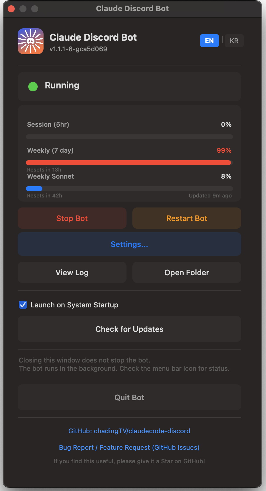
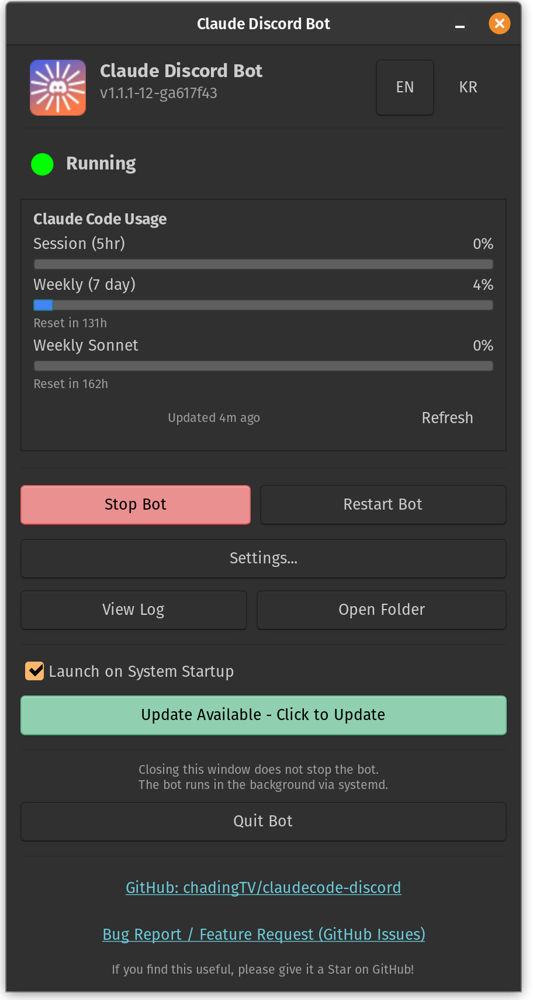
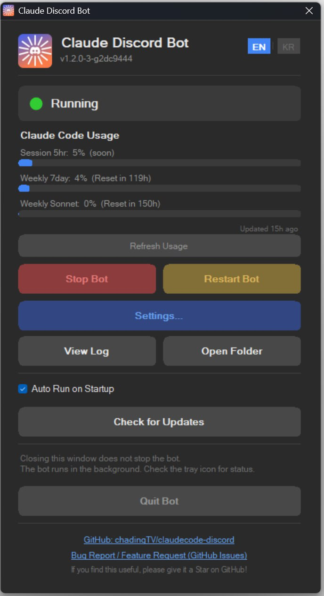

<p align="center">
  
</p>

# Claude Code Discord Controller

[](https://github.com/chadingTV/claudecode-discord/actions)

Control Claude Code from your phone — a multi-machine agent hub via Discord.
**No API key needed — works with your existing Claude Pro or Max subscription.**

<p align="center">
  
</p>

## Why This Bot? — vs Official Remote Control

Anthropic's [Remote Control](https://code.claude.com/docs/en/remote-control) lets you view a running local session from your phone. This bot goes further — it's a **multi-machine agent hub** that runs as a daemon, creates new sessions on demand, and supports team collaboration.

|                              | This Bot | Official Remote |
|------------------------------|:--------:|:---------------:|
| Start new session from phone | ✅       | ❌              |
| Daemon (survives terminal close) | ✅   | ❌              |
| Multi-machine hub            | ✅       | ❌              |
| Concurrent sessions per machine | ✅    | ❌              |
| Push notifications           | ✅       | ❌              |
| Team collaboration           | ✅       | ❌              |
| Native tray app (3 OS)       | ✅       | ❌              |
| Zero open ports              | ✅       | ✅              |

### Multi-PC Hub

Create a separate Discord bot per machine, invite them all to the same server, and assign channels:

```
Your Discord Server
├── #work-mac-frontend     ← Bot on work Mac
├── #work-mac-backend      ← Bot on work Mac
├── #home-pc-sideproject   ← Bot on home PC
├── #cloud-server-infra    ← Bot on cloud server
```

**Control every machine's Claude Code from a single phone.** The channel list itself becomes your real-time status dashboard across all machines and projects.

## Why Discord?

Discord isn't just a chat app — it's a surprisingly perfect fit for controlling AI agents:

- **Already on your phone.** No new app to install, no web UI to bookmark. Open Discord and go.
- **Push notifications for free.** Get alerted instantly when Claude needs approval or finishes a task — even with the phone locked.
- **Conversation chains = sessions.** Mention the bot for a new session, or reply anywhere in an existing chain to continue it.
- **Rich UI out of the box.** Buttons, select menus, embeds, file uploads — Discord provides the interactive components, so the bot doesn't need its own frontend.
- **Team-ready by default.** Invite teammates to your server. They can watch Claude work, approve tool calls, or queue tasks — no extra auth layer needed.
- **Cross-platform.** Windows, macOS, Linux, iOS, Android, web browser — Discord runs everywhere.

## Features

- 💰 **No API key** — runs on Claude Code CLI with your Pro or Max subscription
- 📱 Remote control Claude Code from Discord (desktop/web/mobile)
- 🔀 Multiple independent conversation-chain sessions in every channel or thread
- ✅ Tool use approve/deny via Discord button UI
- ❓ Interactive question UI (selectable options + custom text input)
- ⏹️ Session-specific Stop button and per-chain queueing
- 📎 File attachments support (images, documents, code files)
- 🔄 Session resume/delete/new (persist across bot restarts, last conversation preview)
- ⏱️ Real-time progress display (tool usage, elapsed time)
- 🔒 Per-user rate limiting, fixed workspace, attachment filtering, duplicate instance prevention
- 📊 **Claude Code usage dashboard** in control panel — Session (5hr), Weekly (7day), Weekly Sonnet with progress bars, auto-refresh, click to open usage page

## Tech Stack

| Category | Technology |
|----------|------------|
| Runtime | Node.js 20+, TypeScript |
| Discord | discord.js v14 |
| AI | @anthropic-ai/claude-agent-sdk |
| DB | better-sqlite3 (SQLite) |
| Validation | zod v4 |
| Build | tsup (ESM) |
| Test | vitest |

## Installation

```bash
git clone https://github.com/chadingTV/claudecode-discord.git
cd claudecode-discord

# macOS / Linux
./install.sh

# Windows
./install.bat
```

### Setup Guides

| Platform | Guide |
|----------|-------|
| **macOS / Linux** | **[SETUP.md](SETUP.md)** — terminal-based setup, menu bar / tray app |
|  **Windows** | **[SETUP-WINDOWS.md](docs/SETUP-WINDOWS.md)** — GUI installer, system tray app with control panel, desktop shortcut |

Windows users: `install.bat` handles everything automatically — installs dependencies, builds, creates a desktop shortcut, and launches the bot with a system tray GUI.

<details>
<summary><strong>Project Structure</strong></summary>

```
claudecode-discord/
├── install.sh / install.bat    # Auto-installers
├── mac-start.sh                # macOS background launcher + menu bar
├── linux-start.sh              # Linux background launcher + system tray
├── win-start.bat               # Windows background launcher + system tray
├── menubar/                    # macOS menu bar app (Swift)
├── tray/                       # System tray app (Linux: Python, Windows: C#)
├── src/
│   ├── index.ts                # Entry point
│   ├── bot/
│   │   ├── client.ts           # Discord bot init & events
│   │   ├── commands/           # /sessions, /status, /usage
│   │   └── handlers/           # Message & interaction handlers
│   ├── claude/
│   │   ├── session-manager.ts  # Session lifecycle
│   │   └── output-formatter.ts # Discord output formatting
│   ├── db/                     # SQLite (better-sqlite3)
│   ├── security/               # Rate limiting and path validation
│   └── utils/                  # Config (zod)
├── SETUP.md                    # macOS/Linux setup guide
├── docs/                       # Translations, screenshots
└── package.json
```

</details>

## Usage

Mention the bot in any server channel it can access to start a new session:

```text
@Claude investigate this test failure
```

Reply to any user or bot message already mapped to that conversation to continue its latest session state. To include preceding human conversation explicitly, add `w/N` anywhere in the message (for example, `@Claude w/20 summarize and act`). There is no automatic ambient context.

Replying to an otherwise unrelated human message while mentioning the bot starts a new session and includes only that referenced message. Text, files, and images on the triggering message are passed through; `w/N` context includes all images from the selected messages.

| Command | Description |
|---------|-------------|
| `/status` | Show sessions in the current channel or thread |
| `/sessions` | Inspect or delete sessions in the current channel or thread |
| `/usage` | Show Claude Code usage |

During a turn, one Discord reply is edited in place with progress and streaming output. Approval and question prompts appear separately and are deleted after resolution. On success, the progress reply becomes the final answer; oversized answers continue in mapped follow-up messages.

### In-Progress Controls

- **Stop** cancels only the session shown on that progress message.
- Different chains can run concurrently in the same channel.
- Messages targeting a busy chain are queued for that chain.
- Any user with channel access can continue sessions and use approval, question, stop, and deletion controls.
<details>
<summary><strong>Architecture</strong></summary>

```
[Mobile Discord] ←→ [Discord Bot] ←→ [Session Manager] ←→ [Claude Agent SDK]
                          ↕
                     [SQLite DB]
```

- Independent sessions per Discord conversation chain
- Claude Agent SDK runs Claude Code as subprocess (shares existing auth)
- Write and shell tools require Discord approval
- A single progress reply is edited during streaming and becomes the final answer
- Heartbeat progress display every 15s until text output begins
- Markdown code blocks preserved across message splits

**Session States:** 🟢 working · 🟡 waiting for approval · ⚪ idle · 🔴 offline

</details>

## Security

### Zero External Attack Surface

This bot **does not open any HTTP servers, ports, or API endpoints.** It connects to Discord via an outbound WebSocket — there is no inbound listener, so there is no network path for external attackers to reach this bot.

```
Typical web server:  External → [Port open, waiting] → Receives requests  (inbound)
This bot:            Bot → [Connects to Discord] → Receives events         (outbound only)
```

### Self-Hosted Architecture

The bot runs entirely on your own PC/server. No external servers involved, and no data leaves your machine except through Discord and the Anthropic API (which uses your own Claude Code login session).

### Access Control

- Access follows Discord channel and thread permissions
- Per-user request rate limiting remains enabled
- All agent work is fixed to BASE_PROJECT_DIR`r

### Execution Protection

- Tool use default: file modifications, command execution, etc. **require user approval each time** (Discord buttons)
- Path traversal (`..`) blocked
- File attachments: executable files (.exe, .bat, etc.) blocked, 25MB size limit

### Precautions

- The `.env` file contains your bot token — **never share it publicly.** If compromised, immediately Reset Token in Discord Developer Portal
- Every write or shell action requires explicit approval from a user who can access the channel

## Quick Start by Platform

Each platform runs the bot as a background service with a native GUI for control — no terminal babysitting needed.

### macOS — Menu Bar App

<p align="center">
  
</p>

```bash
./mac-start.sh          # Start (background + menu bar icon)
./mac-start.sh --stop   # Stop
```

Control panel GUI (left-click icon), **Claude Code usage dashboard** (Session 5hr / Weekly / Sonnet, click to open usage page), settings dialog, auto-update, auto-restart on crash, auto-start on boot (launchd). → **[Full guide](SETUP.md)**

### Linux — System Tray + Control Panel

<p align="center">
  
</p>

```bash
./linux-start.sh          # Start (systemd + tray icon)
./linux-start.sh --stop   # Stop
```

GTK3 **control panel** (left-click tray icon), **Claude Code usage dashboard**, settings dialog, auto-restart, auto-start on boot (systemd). Works headless too. → **[Full guide](SETUP.md)**

### Windows — System Tray + Control Panel

<p align="center">
  
</p>

```batch
win-start.bat          &:: Start (background + tray + control panel)
win-start.bat --stop   &:: Stop
```

Desktop shortcut, control panel GUI, **Claude Code usage dashboard**, settings dialog, auto-update, auto-start on logon (Registry). → **[Full guide](docs/SETUP-WINDOWS.md)**

## Development

```bash
npm run dev          # Dev mode (tsx)
npm run build        # Production build (tsup)
npm start            # Run built files
npm test             # Tests (vitest)
npm run test:watch   # Test watch mode
```

## License

[MIT License](LICENSE) - Free to use, modify, and distribute commercially. Attribution required: include the original copyright notice and link to [this repository](https://github.com/chadingTV/claudecode-discord).

---

If you find this project useful, please consider giving it a ⭐ — it helps others discover it!
